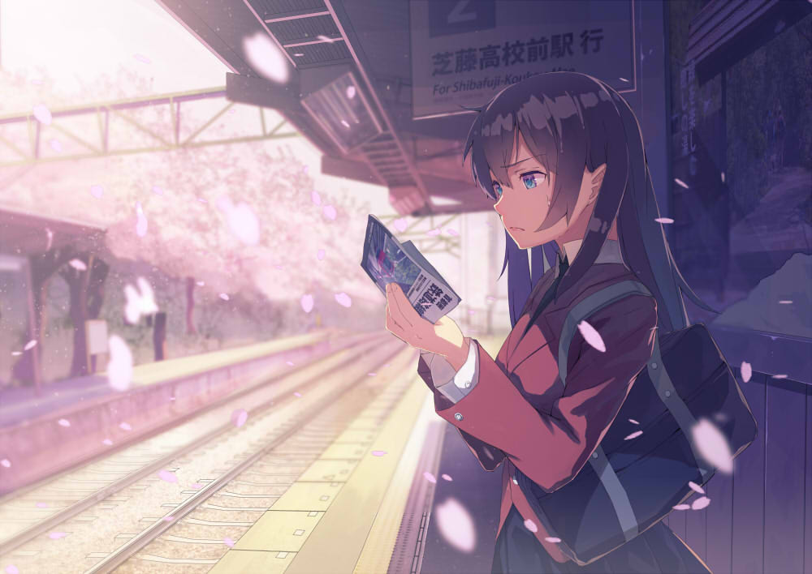

前段时间骑小牛 U1 出门时,当电量显示降至 5%，车子突然断电幸运的是离家只剩几百米，推车回去吧。
<!-- more -->
# 充电无反应，保护板锁死
回家后接上原装充电器，指示灯却直接亮起绿灯，电池根本没在充电。按压电池顶部的状态指示灯按钮，灯光全亮后闪烁三下。万用表测量电池输出口电压，无正常电压输出，电池保护板大概率锁定了。
这个电车用的铝型材外壳的一体化电池包，拆下顶部螺丝后，电芯组可以直接抽出（底部有打胶需要清理）。万用表逐一检测每组电芯电压时发现：13 串电芯中，第一串电压为 3.4V，其余均为 3.6V。虽然总电压维持在 48V 左右（未精确记录），单串电压偏差可能正是导致保护板锁死的原因。

# 绕过保护板进行充电
考虑到电池已使用近 5 年，电芯确实老化了。我决定尝试绕过保护板直接充电。电池升至 50V 时，按压电池顶部的按钮状态灯有了反应不再全亮闪烁，而是显示剩余电量。保护板已解除锁定，停止外接充电，重新组装电池并接回原装充电器。充电器红灯亮起，电池终于恢复正常充电。

# 老化电池的续命
激活后的电池装车测试，骑行表现暂时恢复正常。但作为一个五年的锂电池，本质上是欺骗保护板，并未解决电芯老化的根本问题，只能应急咯。长期使用还是更换电芯或整块电池。
